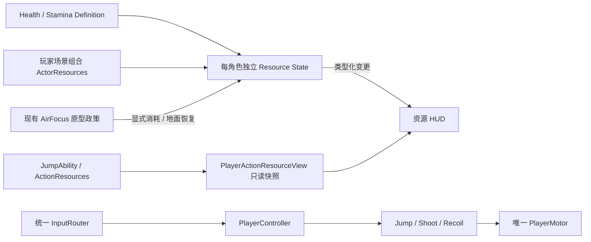

# 模块分类与当前框架

本轮用户要求“先搭载框架和分类分模块，然后下一个任务”。先落地有消费者的资源框架，再完成HEALTH-01；未来系统保持职责/接入点定义，不创建无法运行的空服务。本文描述代码导航，不取代[架构](architecture.md)与各设计权威。

## 已接入模块

| 分类 | 目录/入口 | 所有权与依赖 |
| --- | --- | --- |
| 输入 | scripts/input、scripts/ui/touch_overlay.gd | 三设备适配→InputRouter；不直接消费资源/移动 |
| 角色运动 | scripts/player/player_controller.gd、player_motor.gd | 协调现有能力；Motor仍唯一位移入口 |
| 可启停能力 | scripts/player/jump_ability.gd、air_focus_ability.gd；scripts/combat/shoot_ability.gd、recoil_ability.gd | 请求→能力→资源/唯一Motor，未增加默认动作成本 |
| 资源定义 | scripts/resources/definitions；resources/actors/prototype_health.tres | HealthDefinition/StaminaDefinition可共享，只保存初值/上限/政策ID/时钟域 |
| 类型化资源契约 | scripts/resources/contracts | ActorResourceRequest/Snapshot/Result与ActionResourceSnapshot；局部请求与结果，不用全局总线 |
| 资源状态 | scripts/resources/state | HealthState/StaminaState独立实例；共用有限的数值事务基类，零血仅Health为终态 |
| 角色组合 | scripts/actors/actor_resources.gd | 每个玩家场景一个ActorResources；仅持有两个资源实例，接受Definition，不依赖PlayerTuning/Jump/AI；PlayerActionResourceView单独适配现有动作次数，不拥有输入/运动/Boss/奖励 |
| 动作次数 | scripts/combat/action_resources.gd、scripts/player/jump_ability.gd | 保留各自计数器与0/N规则；PlayerActionResourceView输出的ActionResourceSnapshot只读，不重复实现计数 |
| 射击战斗 | scripts/combat、scripts/world/combat_target.gd | 现有发射事务、反冲、攻击体积与灰盒靶；Health尚未接正式敌人伤害 |
| 世界对象 | scripts/world、scenes/world | 独立场景、局部WorldContext与安全检查；当前危险仍是旧即死灰盒，P2后续迁移 |
| 表现 | scripts/ui/actor_resources_hud.gd、focus_vignette.gd | 订阅状态/能力；不决定资源消费、伤害、胜负、速度 |
| 固定测试与配置 | scenes/test_levels、tests、config/player_tuning.json、config/input_profile.json | 固定灰盒和失败退出码自动测试；物理/输入基础数值仍单一来源 |

## 资源请求与生命周期

HealthDefinition的max/initial默认只在prototype_health.tres定义（当前5/5是固定灰盒fixture，不锁定正式人物平衡）。StaminaDefinition.from_focus_prototype只从现有player_tuning读取100容量及原型政策，不维护重复默认值。Stamina状态没有自动回复/默认动作消费，正式用途Q002继续未定；AirFocus显式消费者只是保留已授权实验。

HealthState提供apply_damage/heal/set_max，StaminaState提供try_consume/grant；参数是带event_id、expected_epoch、expected_instance_id和正有限amount的ActorResourceRequest。instance_id仅运行期身份，不序列化到存档。每资源独立收据：同ID/同操作/同值返回只读原收据、无第二次变更；异payload拒绝；新生命周期递增epoch，旧请求/其他实例请求拒绝。快照/结果是脱离状态的副本，UI修改不能改状态或重试收据。

数值变更后发changed(result:ActorResourceResult)，无效/过期/不足/重复不发新事件。set_max的amount是目标上限，不是增加量；增加最大HP不隐式恢复当前HP，HP归零后heal/set_max拒绝。未来奖励/Modifier先计算目标值后用此入口，DamagePolicy须先完成伤害资格/批次再提交HP，当前不是完整DamagePolicy。

Stamina的consume_continuous/grant_continuous专供已绑定能力在本tick同步执行的实时脉冲，不存逐帧收据避免无界增长；仍校验epoch/正有限数值与余额。延迟/重试/补给请求必须用带ID的事务接口。公共事务收据保留至当前资源生命周期结束；正式长局账本范围与持久策略在后续服务任务细化，不用逐帧ID充满账本。

configure仅用于实例建立/明确新生命周期，复制定义中的值，不保留可共享Definition为可变状态。旧PlayerController.reset_at仍是历史整关重启，会重建Health/Stamina周期；SEGMENT-01必须使用选择性回退，不能调用它恢复满HP/精力。零HP的资源终态已实现，零HP→RunEnd/Home未在本任务实现。

## 分阶段模块接入表（按行标明实际状态）

| 阶段/任务 | 后续模块 | 接入边界 |
| --- | --- | --- |
| P2 ENEMY-01（已接入） | scripts/enemies、resources/enemies、scenes/enemies | 独立Actor/巡逻AI/意图/Motor/Health/表现与Damageable兼容桥；主动攻击/玩家受伤待DAMAGE-01 |
| P2 DAMAGE/SEGMENT/DEATH | scripts/damage | 类型化DamageRequest→批次→HealthState；Motor安全定位；最小RunLifetime/Home占位，替换旧即死 |
| P3 SUPPLY/BUILD/REWARD/SHOP | scripts/builds、scripts/rewards | 明确Effect/来源Modifier→资源/能力；奖励与交易账本不随角色回退刷新 |
| P4 RUN/BOSS/HOME | scripts/run、BossEncounter与家园场景 | 固定开发3关、两出口、Boss必得金奖、终局取消；各服务拥有本局状态 |
| P5 RUN-TEN/GEN | scripts/generation | 正式10/Boss10、独立随机流、版本化Manifest；先通过新固定挑战真机门槛 |
| P6 META/SAVE/CONTENT | scripts/meta、scripts/save及内容定义 | RunPolicy/Meta分离；版本/原子写入/恢复/迁移；平台适配可选 |

新增分类、实例与配置不得使Controller成为资源/经济管理器。新任务有实际消费者再新增模块目录、定义和服务；当前没有万能GameManager/事件总线/空商店或空Boss。
