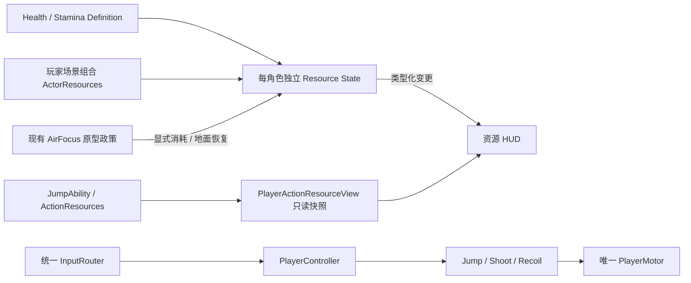

# 模块分类与当前框架

本轮用户授权连续分阶段推进至完整可玩demo。P2伤害/回退/死亡、P3补给/构筑/奖励/商店、P4固定三关/Boss/家园与P5正式十关固定试炼均通过实际消费者接入；正式随机地图、完整永久经济/存档仍延后。本文描述代码导航，不取代[架构](architecture.md)与各设计权威。

## 已接入模块

| 分类 | 目录/入口 | 所有权与依赖 |
| --- | --- | --- |
| 输入 | scripts/input、scripts/ui/touch_overlay.gd | 三设备适配→InputRouter；不直接消费资源/移动 |
| 角色运动 | scripts/player/player_controller.gd、player_motor.gd | 协调现有能力；Motor仍唯一位移入口 |
| 可启停能力 | scripts/player/jump_ability.gd、air_focus_ability.gd；scripts/combat/shoot_ability.gd、recoil_ability.gd | 请求→能力→资源/唯一Motor，未增加默认动作成本 |
| 资源定义 | scripts/resources/definitions；resources/actors/prototype_health.tres | HealthDefinition/StaminaDefinition可共享，只保存初值/上限/政策ID/时钟域 |
| 类型化资源契约 | scripts/resources/contracts | ActorResourceRequest/Snapshot/Result与ActionResourceSnapshot；局部请求与结果，不用全局总线 |
| 资源状态 | scripts/resources/state | HealthState/StaminaState独立实例；共用有限的数值事务基类，零血仅Health为终态 |
| 角色组合 | scripts/actors/actor_resources.gd | 每个玩家场景一个ActorResources；仅持有两个资源实例，接受Definition，不依赖PlayerTuning/Jump/AI；PlayerActionResourceView单独适配现有动作次数，不拥有输入/运动/Boss/奖励 |
| 动作次数 | scripts/combat/action_resources.gd、scripts/player/jump_ability.gd | 保留各自计数器与0/N规则；PlayerActionResourceView输出的ActionResourceSnapshot只读，不重复实现计数 |
| 射击战斗 | scripts/combat、scripts/world/combat_target.gd | 现有发射事务、反冲、攻击体积与灰盒靶；玩家弹体通过Damageable桥接当前帧伤害批次 |
| 世界对象 | scripts/world、scenes/world | 独立场景、局部WorldContext与安全检查；旧WorldContext仅Legacy灰盒；新demo使用段回退与局内账本 |
| 表现 | scripts/ui/actor_resources_hud.gd、focus_vignette.gd | 订阅状态/能力；不决定资源消费、伤害、胜负、速度 |
| 菜单 | scripts/ui/demo_menu.gd | DemoMenu仅展示主页/暂停/设置/帮助/构筑/返回确认；通过局部signals请求App暂停、开局和应用输入，不决定胜负或修改Motor |
| 固定测试与配置 | scenes/test_levels、tests、config/player_tuning.json、config/input_profile.json | 固定灰盒和失败退出码自动测试；物理/输入基础数值仍单一来源 |

## 资源请求与生命周期

HealthDefinition的max/initial默认只在prototype_health.tres定义（当前5/5是固定灰盒fixture，不锁定正式人物平衡）。StaminaDefinition.from_focus_prototype只从现有player_tuning读取100容量及原型政策，不维护重复默认值。Stamina状态没有自动回复/默认动作消费，正式用途Q002继续未定；AirFocus显式消费者只是保留已授权实验。

HealthState提供apply_damage/heal/set_max，StaminaState提供try_consume/grant；参数是带event_id、expected_epoch、expected_instance_id和正有限amount的ActorResourceRequest。instance_id仅运行期身份，不序列化到存档。每资源独立收据：同ID/同操作/同值返回只读原收据、无第二次变更；异payload拒绝；新生命周期递增epoch，旧请求/其他实例请求拒绝。快照/结果是脱离状态的副本，UI修改不能改状态或重试收据。

数值变更后发changed(result:ActorResourceResult)，无效/过期/不足/重复不发新事件。set_max的amount是目标上限，不是增加量；增加最大HP不隐式恢复当前HP，HP归零后heal/set_max拒绝。未来奖励/Modifier先计算目标值后用此入口，DamagePolicy须先完成伤害资格/批次再提交HP，新demo使用FrameDamagePolicy批次选择与终局优先。

Stamina的consume_continuous/grant_continuous专供已绑定能力在本tick同步执行的实时脉冲，不存逐帧收据避免无界增长；仍校验epoch/正有限数值与余额。延迟/重试/补给请求必须用带ID的事务接口。公共事务收据保留至当前资源生命周期结束；正式长局账本范围与持久策略在后续服务任务细化，不用逐帧ID充满账本。

configure仅用于实例建立/明确新生命周期，复制定义中的值，不保留可共享Definition为可变状态。旧PlayerController.reset_at仍是历史整关重启，会重建Health/Stamina周期；SegmentRespawn已使用return_to_segment选择性回退，不能调用它恢复满HP/精力。新demo零HP经批次→RunEnd→Home，旧reset_at仅Legacy测试/明确新生命周期使用。

## 分阶段模块接入表（按行标明实际状态）

| 阶段/任务 | 后续模块 | 接入边界 |
| --- | --- | --- |
| P2 ENEMY-01（已接入） | scripts/enemies、resources/enemies、scenes/enemies | 独立Actor/巡逻AI/意图/Motor/Health/表现与Damageable兼容桥；demo接触玩家受伤已桥接FrameDamagePolicy，更多攻击模式后续扩展 |
| P2 DAMAGE/SEGMENT/DEATH（已接入） | scripts/damage | 类型化DamageRequest→批次→HealthState；Motor安全定位；DemoLifetime token与RunDirector终局，替换新demo即死 |
| P3 SUPPLY/BUILD/REWARD/SHOP（已接入） | scripts/builds、scripts/rewards、scripts/shops | 明确Effect/来源Modifier→资源/能力；奖励与交易账本不随角色回退刷新 |
| P4 RUN/BOSS/HOME（已接入） | scripts/run、scripts/bosses、scripts/meta、scripts/demo、scenes/demo | 固定开发3关、两出口、Boss必得金奖、终局取消；各服务拥有本局状态 |
| P5 RUN-TEN（固定试炼已接入）/GEN（未实现） | scripts/run、scripts/demo；后续scripts/generation | 固定正式10/Boss10、六类房间、biome_complete与Meta completed_biomes；已有分流/版本化Manifest记录实际输出；用户初验已报告；生成设计已交付，四个静态模块及Module Lab已接入；完整拓扑/难度与详细设备证据分任务 |
| P6 META/SAVE/CONTENT | scripts/meta、scripts/save及内容定义 | RunPolicy/Meta分离；版本/原子写入/恢复/迁移；平台适配可选 |

新增分类、实例与配置不得使Controller成为资源/经济管理器。新任务有实际消费者再新增模块目录、定义和服务；DemoApp只组合局部服务/界面与场景，DamagePolicy、Build、Shop、Reward、BossEncounter、RunDirector各自负责规则；没有万能事件总线。实际测试、构建与设备状态见[交接](handoff.md)，不能把“已接入”当成已真机验收。

默认入口`scenes/demo/demo.tscn`由主页选择3关开发链或10关固定大关试炼。3关为HOME→combat→shop/item_reward→Boss→金奖励→HOME；10关含combat/shop/coin_reward/health_reward/item_reward/boss实际消费者，第9关Boss必达，金奖励后biome_complete→HOME。DemoApp把五项输入设置保存在当前会话，新局沿用；MetaProgression独立记录completed_biomes，不把一大关完成算成整局成功。`scenes/test_levels/graybox.tscn`继续独立保留历史运动/输入/机关回归，必须显示LEGACY用途。Manifest由各消费者记录实际输出；SaveService与GEN不是已实现模块。

StageTypeDefinition现在持有可注入的`StageCompletionRule`资源；`rule()`返回脱离副本。现有目标击败、到达终点、领取并到终点、仅领取分别验证所需输入；实际完成由该组件判断，不在核心装载器堆类型判断。定义字符串ID只保留兼容映射，未知ID失败。运行时房间显示名采用English Combat/Shop/Coins/Health/Items/Boss以避免未安装中文字体的Web缺字，稳定type/icon ID不变。

生成设计导航：LayoutPlanner/ModuleAssembler/LevelValidator/CameraRig/DifficultyProfile契约见[procedural_generation](procedural_generation.md)；8蓝图见[platforming_modules](platforming_modules.md)，P/C/T/R曲线见[difficulty_profiles](difficulty_profiles.md)。这些名称尚未作为运行时服务创建；当前入口仍固定地图。

静态生成模块：PlatformingModuleDefinition/PlatformingModulePort/PlatformingModule负责独立资源、契约筛选、真实平台与绘制。ModuleLab作为实际消费者复用Player/InputSetup/FrameDamagePolicy/SegmentRespawn/DemoLifetime；Explicit新尝试与非致命选择性回退分开。无新增Player位移入口，无全局事件总线。动态与完整生成服务尚未创建。
