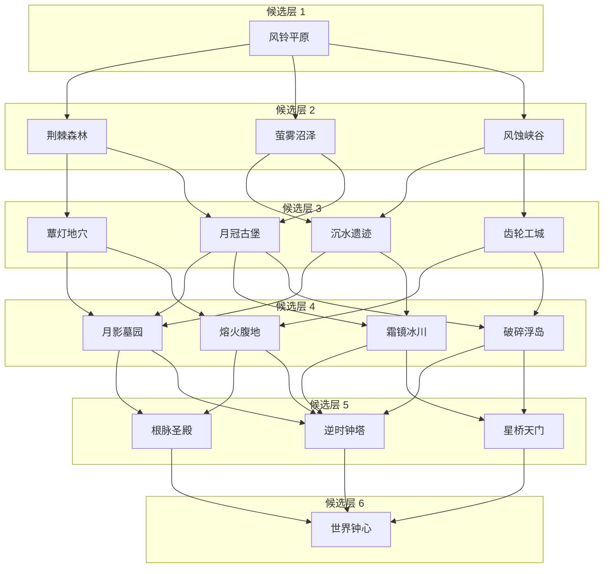

# 世界、大关与故事风格锚点

2026-10-10用户要求将交接文档的大关和故事背景纳入整个项目，作为后续风格锚点。原文[交接v0.2](references/recoil_roguelike_handoff_v02.md)完整保留；本文件为整合后的叙事/区域风格权威，[区域目录](world_regions.json)为可检查的设计数据，**不是运行配置或已实现地图**。运行与奖励/死亡仍分别遵循原权威契约。讨论建议不自动升级成产品定案。

## 已采用方向与未定内容

采用反冲位移为核心、精确平台动作和探索为主、战斗服务于空间压力与Boss动作考验的原创童话冒险。第一大关固定平原；每大关正式10小关/10 Boss，Boss必出一个金道具。既有攻击弹体、松手射击、0/N跳跃与空中射击次数、土狼时间、跳跃缓冲和短按小跳长按大跳保持；不因附件写“基础能力待定”删掉现有原型，也不新增冲刺/墙跳门槛。

世界之钟与脉冲维修工具成为背景和造型基线；《失序之钟》《鸣钟枪》以及各区域名称均为工作名，不改仓库/应用正式名称。六层路线、16区域长期池、45–75分钟局长为暂定建议；formal_run.biome_count仍未锁定，不把六层硬编码进当前RunDirector。极难动作链优先放可选奖励支路是节奏候选，现有高级挑战仍保留为独立练习，不自动塞进平原第一间必经房。

主角身份、君主动机细节、守钟人关系、复活原理、重启代价与结局分支待决定；不编造大量对话。精力用途、经济和永久升级成本继续按Q002/Q008/Q012待定，不因新剧情让枪消耗精力或取消原已授权的永久基础升级方向。

## 背景与情感基调

世界之钟原本维持季节、道路和生命循环。旧王国试图把时间留在美好的时刻，控制装置失效、世界之钟破碎：森林持续生长，雪城凝在最后一天，熔炉过热，灵魂无法安息，无人机械仍在工作。主角从平原的发光花旁醒来，带着与远方钟声呼应的便携脉冲工具，沿断桥和古代维修通道寻找源头。

表层是柔和日光、童话探索与明快动作，深层通过环境线索显露悲伤。钟声解释道路的周期性重排，地区历史与连接白名单保持稳定。枪首先是维修工具，向一个方向发射、向反方向位移，使射击与跳跃在世界内具有用途；实际合成速度仍由Motor决定，不承诺一定命中后才反冲，不新增碰墙加推力。

“平原苏醒”对应平原边缘的安全家园及其发光花意象，**不是随机小关入口或段内锚点**。零血仍RunEnd→Home，清本局临时构筑；存活环境伤害仍只做段内回退。已发现故事信息未来存入Meta并持久化，当前仅进程内摘要，不宣称已做剧情存档。失败不等于重抽整个仍存活的关卡，也不能靠故事解释重复刷奖励。

## 六层候选网络与两层选择

层级1平原起点 → 层级2自然外围 → 层级3文明遗迹 → 层级4失序地带 → 层级5核心外围 → 层级6世界钟心。每层选一个区域形成候选六大关路线，共60个小关而非同时清理16区域；该数量未定案，局长必须实际测量。

此图仅展示候选网络，不表示地区已制作或开放：

连接白名单唯一数据来源为world_regions.json，原文3.1表可追溯。隐藏跳层路线后置，不在常规邻接表中。区域抽样需过滤未实现/未解锁/无法继续到终点的内容；不把目前仅有平原皮肤视为已经能开放整条网络。候选多于两个时按独立region_route随机流选择常规两个不同目的地；第五层只有一个钟心终点，不制造假选择。抽样不足时使用明确可通关固定开发路径或报告内容不足，不开放空地图。

小关出口属于StageExitOffer：选择下一小关类型，当前主题保持；大关出口属于BiomeExitOffer：在Boss胜利及金奖合法结算后选择下一地区。两者具有独立ID/epoch/唯一提交和版本记录，不能复用stage_index来偷换地区，也不能把候选数计为实际通关数。第9小关必达Boss10已确认；附件建议一条明确Boss出口，当前demo仍两个Boss候选，单出口呈现仅保留建议，不擅改实现。

## 区域视觉、动作与叙事目录

下表均为长期锚点；除平原demo皮肤外，区域内容/特殊机制尚未制作。外观名不等于行为已实现：风力、弹跳花、冰面摩擦、涨潮、显隐、低重力和冻结须分别开发和真实轨迹验证，不能换皮即宣称有机制。

| 层 | 区域工作名 | 视觉锚点 | 机制创意（未实现不开放） | 环境叙事 |
| --- | --- | --- | --- | --- |
| 1 | 风铃平原 | 嫩绿草甸、木桥、风车、风铃花与柔和阳光 | 基础跳跃、缓慢移动平台、微弱上升气流、弹跳花 | 时间仍较正常，但部分花朵已停止生长 |
| 2 | 荆棘森林 | 巨树、藤蔓、被吞没的皇家花园 | 周期荆棘、弯曲枝台；摆荡可后置 | 生长魔法失控，村庄被植物覆盖 |
| 2 | 萤雾沼泽 | 蓝绿薄雾、荷叶、木桩与漂流灯笼 | 浮沉平台、漂浮荷叶、涨潮 | 求救灯笼与被遗弃的水道 |
| 2 | 风蚀峡谷 | 暖色砂岩、吊桥、散落商队货物 | 横风、风洞、易碎岩台；滑沙可后置 | 商路被持续狂风切断 |
| 3 | 蕈灯地穴 | 蓝紫发光菌群、柔软地下洞穴 | 蘑菇弹台、孢子气流、发光道路 | 菌群保留灾难前的记忆 |
| 3 | 沉水遗迹 | 青蓝水体、苔藓石柱与旧符号 | 升降石柱、水位机关、浮台 | 世界之钟的古代技术与早期实验 |
| 3 | 齿轮工城 | 黄铜、管道、齿轮与无人车间 | 传送带、活塞、机械门、轨道平台 | 工匠建造控制装置的证据 |
| 3 | 月冠古堡 | 蓝紫月光、破损阳台、吊灯与空王座 | 升降桥、落石、吊灯平台、活动墙 | 所有钟表停在同一刻，留下君主的动机线索 |
| 4 | 月影墓园 | 冷色月光、墓碑、幽灵与柔雾 | 周期显隐平台、钟声机关、幽魂追逐 | 灵魂无法离开，守墓人等待清晨 |
| 4 | 霜镜冰川 | 冰蓝悬崖、极光与冻结城镇 | 低摩擦冰面、断裂冰台、落冰 | 居民停留在灾难最后一刻 |
| 4 | 熔火腹地 | 橙红熔岩、玄武岩与失控熔炉 | 喷发周期、热气流、坠石、局部熔岩上涨 | 原本供暖与驱动时钟的设施成为灾难 |
| 4 | 破碎浮岛 | 云海、紫蓝天空、残存空中花园 | 崩塌云桥、连续弹跳、风向变化 | 时间冲击撕裂天空花园 |
| 5 | 根脉圣殿 | 巨型树根、生命光点与自然祭坛 | 伸缩枝台、根脉移动平台 | 大地本有调节季节的力量 |
| 5 | 逆时钟塔 | 钟针、摆锤、巨大齿轮与时间残影 | 摆锤、旋转平台、冻结机关 | 停止时间的完整过程 |
| 5 | 星桥天门 | 星空、悬桥、天文环与光路 | 光影平台；低重力区域可后置 | 世界之钟与天空的时间轨道相连 |
| 6 | 世界钟心 | 巨钟内部与本局经过地区的残影 | 已学机制的终局组合 | 主角、守钟人与复活的关系，以及重启的代价 |

## 剧情与随机路线兼容

主线信息按层级交付，支线按区域补充。1异常与召唤；2自然失序扩散；3王国主动干预；4灾难影响生命与居民；5原因/关联/代价；6终局选择有前文支撑。各合法路线均有必经或等效替代线索，不能把关键事实只投在稀有随机房。

使用风铃花、维修站方向图、停在同一刻的钟表、工匠笔记、冻结居民与空王座，辅以短NPC互动。阅读可简化/跳过，不长时间锁定角色；强制叙事放安全区，不在瞄准、跳跃或机关窗口抢输入。线索发现以stable_story_id/version去重，来源区域记录到RunManifest，已发现集合及区域解锁在MetaProgression；未来SaveService原子提交与迁移，不能直接保存Node或改奖励账本。

最终守钟人与路线机制回响仅为候选。终局Boss可以分阶段使用本局实际学过且经过验证的机制，但不能同时叠加所有危险或随机删关键躲避空间；正式名称/身份/结局不在本轮定稿。

## 统一制作与后续模块

简洁手绘童话、清楚剪影、统一线条/比例与轻量分层；草绿日光、蓝绿薄雾、月光冷色、黄铜动力和熔火暖色随主题变化，世界共同保留风铃/脉冲环/维修刻度/同源黄铜符号。角色当前courier与枪模型是demo候选，不自动确定真实身份。枪口光点和位移轨迹要短而清楚，声音以后原创制作，不为钟声节拍延迟输入。

先验证模块的站立边、运动与资源，再套区域皮肤。平台端头/中段/填充/连接角与装饰分离，资产锚点/密度沿用现有art契约；背景低对比，危险和补充功能颜色可跨区辨识。森林可用枝台、冰川用冰台、工城用轨道，但同类机关共用逻辑，不改唯一Motor。所有必经路径按已声明基础能力与实际武器反冲/冷却/空中次数重新验证，弱反冲不必然是升级，强反冲须检查过冲；正式精力未定时不设精力硬门槛。

平原模块以基础下射抬升、侧射跨断桥、可观察移动台介绍维修用途；高崖、断桥、风车台的皮肤映射见[平原模块设计](plains_module_design.md)。新增花/风/木吊台意象先做安全样片，保留当前已验证黄铜平台，不一轮替换全部关卡。

## 分阶段范围

1. 当前阶段保留控制、生成和已接平原皮肤，完成单大关随机10节点/Boss闭环与局部转折/分叉验证。
2. 平原→森林→古堡作为开发前三层切片，验证主题过渡/独立路线与短环境线索；不冒称完成六层。
3. 沿合法路线平原→森林→古堡→冰川→钟塔→钟心补首条完整候选路线，先确认六大关与局长；之后再加同层分支。
4. 逐步扩展16区域候选池、区域解锁、隐藏路线与结局；未完成内容保持不开放。玩具工坊/水晶矿洞等只在原文创意储备，未加入首版16区。

本轮只交付设计、可追溯目录和检查；没有创建16个空运行场景，没有实现跨大关/剧情/新机关，没有更改现有可玩demo与资产。
